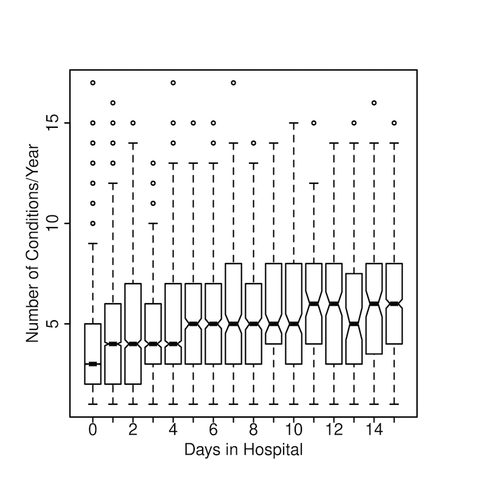
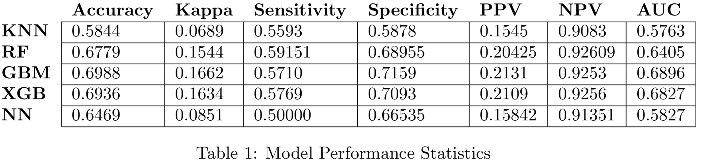

# Data Mining Labs

## Project 1
, we analyze the relationships between various medical claim attributes in order to better understand what sort of health predictors can lead a person to hospital admission. The prediction of a person’s number of days spent in a hospital the following year could be a valuable metric, especially for insurance companies that will be paying for these hospital visits.

We conclude that attributes like age, number of medical conditions, and number of claims are good indicators of whether or not people will be admitted into the hospital the following year. Furthermore, we show that severity of sickness (Charlson index) and the number of visits a patient makes to internal specialists, can help us predict how long patients will stay in the hospital.

---
## Project 2
 we look at data from insurance health claims, and attempt to find meaningful clusters within the data. Although the data seems to have little clustering tendency, we were able to find some clusterings separated by demographic data and overall health. Using PCA and k-means clustering we were also able to develop a basic prediction model for number of days spent in the hospital by a person in the next year.

With the k-means clusterings of principal components from count features, we were able to find 2 clusters, for below average, and above average days in the hospital. We can use these clusterings to do some prediction on the number of days in hospital, and by looking at the amount of people in each cluster, we could then get an estimate of how many more people will be in the hospital the next year.
---

## Project 3
, we use several machine learning models to perform a classification task. That task was to predict whether or not a person will visit a hospital next year. We tested five different models and used a sensitivity metric to conclude that a random forest worked best for this dataset. We argue that this model could be deployed to aid hospitals in predicting the number of returning patients.

Our best model, a random forest, was able to get a sensitivity about 10% higher than random guessing. It is likely that this data is not very predictive, and with additional features per person we could make better predictions. It is also possible that given a larger dataset with millions of members, a deep neural network could be created to give a more accurate prediction.
---

## Project 4
, we explore frequent itemsets and association rules mined from a dataset consisting of people’s insurance claim history, as well as other features such as the number of days they spent in the hospital, number of unique prescriptions and number of lab visits. By searching for association rules that imply our target class (number of days in hospital the next year), we were able to find some sets of medical conditions that could be used as a signal for determining if and for how long a person visits the hospital the next year.

By looking at the frequent condition sets, as well as rules with high lift, we were able to find some interesting combinations of sets that point towards a person spending 2-4, and 5+ days in the hospital. For example, having pregnancy conditions and no other health issues almost guarantees that a person will be in the hospital the next year. More critical combinations such as those with gastrointenstinal issues and heart failures usually lead to more days in the hospital.
